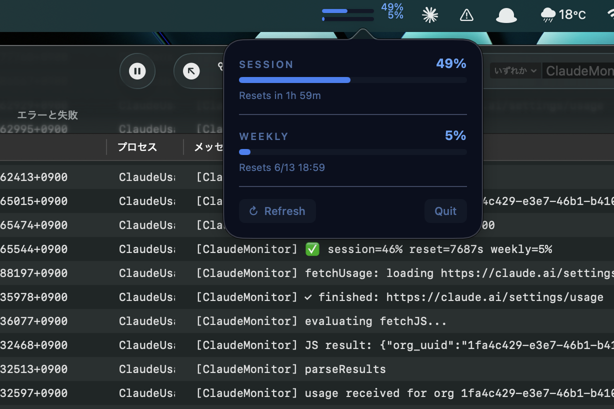

# ClaudeUsageMonitor

macOSメニューバーでClaude.aiの使用量をリアルタイム表示するアプリ。

  

> 📝 制作記事: [【実録】Claude.aiの使用量をメニューバーで表示する「ClaudeMonitor」をヴァイブコーディングした【所要時間2時間】](https://palmfan.com/claude-usage-monitor-menubar-diy)

## 概要

Claude.aiの使用量（セッション・週間）をmacOSメニューバーにリアルタイム表示するアプリ。

| 項目 | 内容 |
|------|------|
| 開発日 | 2026-06-08 |
| 言語 | Swift / SwiftUI |
| 最低macOS | macOS 13 Ventura |
| ライセンス | MIT |
| 参照OSS | [theDanButuc/Claude-Usage-Monitor](https://github.com/theDanButuc/Claude-Usage-Monitor) (MIT) |

## 機能

- セッション使用量（5時間ウィンドウ）と週間使用量をメニューバーにミニプログレスバーで表示
- 使用量に応じた色分け（通常=青、警告80%+=オレンジ、危険95%+=赤、stale=グレー+⚠）
- ポップオーバーで詳細表示（リセットまでのカウントダウン付き）
- 使用量80% / 90% / 100%でmacOS通知
- APIキー不要（claude.aiのセッションCookieを使用）

## スクリーンショット



## インストール

```bash
git clone https://github.com/msakhrs-alt/ClaudeUsageMonitor.git
cd ClaudeUsageMonitor
bash scripts/build.sh
cp -R build/arm64/ClaudeUsageMonitor.app /Applications/
xattr -cr /Applications/ClaudeUsageMonitor.app
open /Applications/ClaudeUsageMonitor.app
```

初回起動時にClaude.aiへのログイン画面が表示されます。ログイン後、自動的にモニタリングが開始されます。

ログイン自動起動：`システム設定 → 一般 → ログイン項目と機能拡張 → + で追加`

## 技術仕様

### データ取得方式

- `WKWebView` で `claude.ai/settings/usage` を非表示ロード
- JavaScriptで `GET /api/organizations` → org UUID取得 → `/api/organizations/{uuid}/usage` の2段階フェッチ
- セッションCookieは `WKWebsiteDataStore.default()` で永続化
- APIキー不要

### APIレスポンス構造

```json
{
  "five_hour": { "utilization": 37.0, "resets_at": "2026-06-07T16:30:00.5Z" },
  "seven_day": { "utilization": 0.04, "resets_at": "..." }
}
```

**注意：** `five_hour.utilization` は0〜100スケール、`seven_day.utilization` は0〜1スケール（異なる）

### デザインテーマ

- メニューバー：ミニプログレスバー×2（セッション/週間）
- ポップオーバー：ディープスペーステーマ（`#0a0f1e` 背景、`#3b82f6` アクセント）

### ファイル構成

```
ClaudeUsageMonitor/
├── ClaudeUsageMonitorApp.swift
├── AppDelegate.swift
├── LoginWindowController.swift
├── Models/
│   └── UsageData.swift
├── Services/
│   ├── ClaudeAPIService.swift
│   ├── NotificationService.swift
│   └── UpdateService.swift
└── Views/
    ├── ContentView.swift
    └── StatusBarView.swift
```

## 開発ドキュメント

- `ClaudeUsageMonitor_SPEC.md` — 仕様書（Claude Code渡し用）
- `DESIGN_UPDATE.md` — デザイン指示書
- `TIPS.md` — 実装時のTips（WKWebView・API・callAsyncJavaScript等）
- `BUGFIX_LOG.md` — バグ修正ログ

## 更新履歴

### v1.1.0 (2026-06-08)

- **fix:** `/api/bootstrap` 廃止 → `GET /api/organizations` 直接呼び出しに変更（Loading...問題を修正）
- **fix:** セッション0%でもデータ正常と判定するよう修正（`five_hour` キー存在確認に変更）
- **fix:** JS完了後にWKWebViewをブランクページへ遷移しメモリを解放（2.4GB → 200MB以下）
- **feat:** アプリアイコン追加（ディープスペーステーマ）

### v1.0.0 (2026-06-08)

- 初回リリース

## 主なバグと解決

| # | 症状 | 原因 | 解決 |
|---|------|------|------|
| BUG-03 | JSが発火しない | WebViewがビュー階層に未所属 | 画面外ウィンドウ（x:-2048）に載せる |
| BUG-05 | async JSの戻り値が取れない | evaluateJavaScriptはPromise非対応 | callAsyncJavaScriptに変更 |
| BUG-08 | データが全く取れない | APIエンドポイントの特定ができていなかった | bootstrap→org UUID→usage の2段階フェッチ |
| BUG-09 | 週間使用量が常に0% | seven_dayのキー名・スケールの誤認識 | キー名修正 + 0〜1スケールの正規化 |
| BUG-10 | stale表示が自動更新されない | updateStatusBarがデータ受信時のみ呼ばれていた | カウントダウンタイマー内でも呼ぶよう変更 |
| BUG-11 | Loading...のまま表示されない | /api/bootstrapのレスポンス構造変更でorg UUID取得不可 | GET /api/organizations 直接呼び出しに変更 |
| BUG-12 | メモリ使用量が2.4GBを超える | WKWebViewがページを常駐保持 | JS完了後にブランクページへ遷移して解放 |

## ライセンス

MIT
